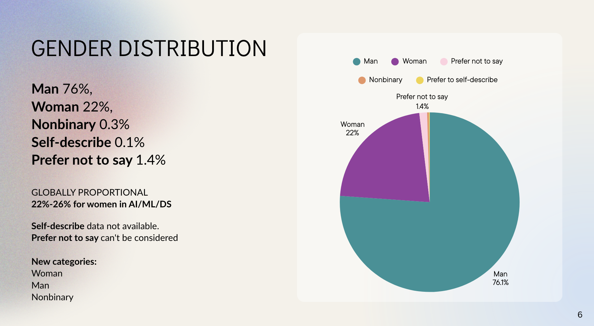
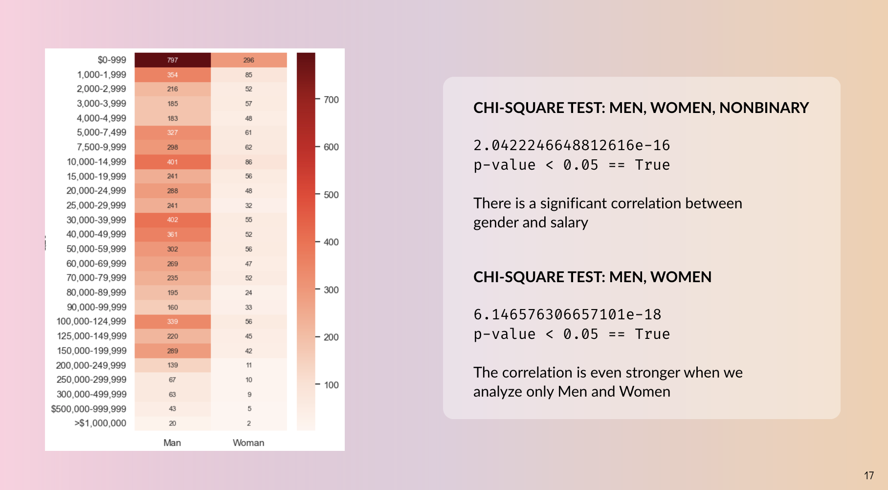
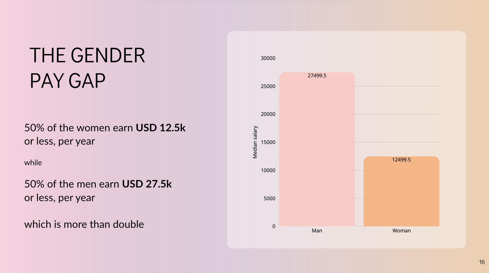
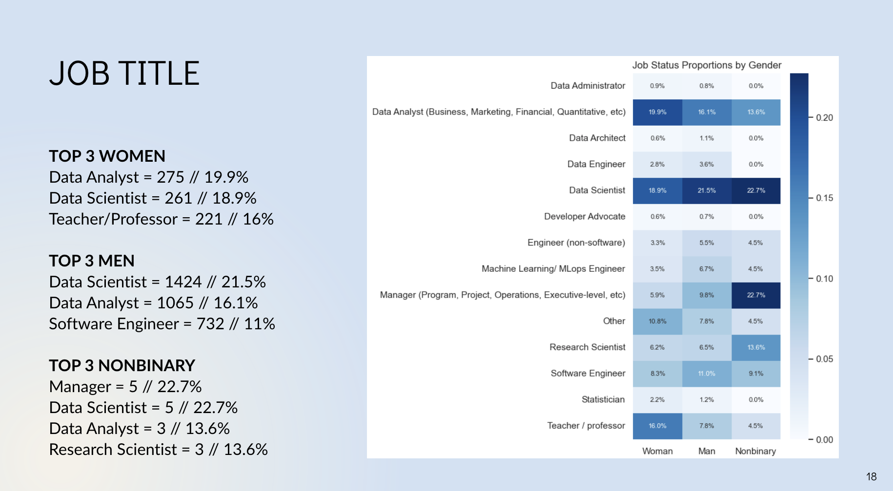
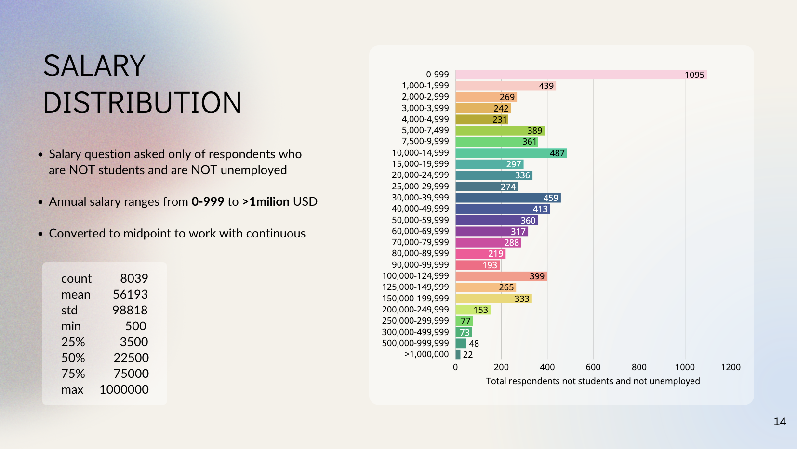

# Gender Gap Analysis in Data Science

## Project Overview
This project analyzes the gender gap among data science and machine learning professionals using the 2022 Kaggle survey data with nearly 24,000 responses. It includes data cleaning, SQL-driven exploration, statistical tests, and visualization with Python and Tableau to uncover disparities in salary, education, and leadership roles.

## Business Challenge
The main question addressed is: Is there a gender gap in pay, education, and leadership roles within the data science and machine learning fields? The analysis seeks to quantify pay discrepancies and explore other gender-related professional differences.

## Methods and Tools
- Data cleaning and preprocessing with Python (Pandas, NumPy)
- Exploratory Data Analysis using Matplotlib, Seaborn
- SQL queries on imported datasets to answer business questions
- Statistical tests (Chi-square) to assess significance of findings
- Data visualization with Python and Tableau

## Dataset
The dataset is from the 2022 Kaggle Machine Learning & Data Science survey, with over 23,997 responses collected globally. Some limitations include biased sampling methods and anonymized open-ended responses.

## Deliverables
- Well-documented Python scripts covering data cleaning, analysis, and SQL integration
- SQL query files addressing predefined business questions
- Presentation slides summarizing key findings
- Visualizations highlighting gender disparities in salary, education, and roles

